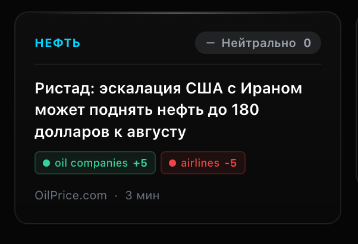

# NewsCard — UI-компонент новостной карточки

> **Файлы:** `src/components/NewsCard.tsx`, `src/components/SentimentTooltip.tsx`
> **Версия:** 8.0.0
> **Дата:** 2026-06-01

---

## 1. ОБЗОР

Карточка новости — glassmorphism-дизайн с Liquid Glass эффектом. Два варианта:
- **Portrait** (портрет): 75vw / 275px ширина, вертикальная раскладка
- **Landscape** (ландшафт): 85vw / 425px ширина, 225px высота, горизонтальная раскладка

---

## 2. ВИЗУАЛЬНЫЕ ЭЛЕМЕНТЫ

### 2.1 Фон карточки (Liquid Glass)

| Sentiment | Градиент фона | Граница | Тень |
|-----------|---------------|---------|------|
| **positive** | `linear-gradient(180deg, rgba(52,211,153,0.06) 0%, rgba(52,211,153,0.02) 100%)` | `rgba(52,211,153,0.15)` | зелёное свечение снизу |
| **negative** | `linear-gradient(180deg, rgba(239,68,68,0.06) 0%, rgba(239,68,68,0.02) 100%)` | `rgba(239,68,68,0.15)` | красное свечение снизу |
| **neutral** | `linear-gradient(180deg, rgba(255,255,255,0.03) 0%, rgba(255,255,255,0.01) 100%)` | `rgba(255,255,255,0.08)` | нейтральная тень |

**Hover эффект:**
- `scale(1.02)`, `translateY(-0.5px)` — лёгкое увеличение
- Граница ярче (opacity 0.15 → 0.35)
- Тень сильнее (glow усиливается)
- `transition: all 300ms`

### 2.2 Подсветка сверху

Горизонтальная линия 1px в цвете sentiment:
```
linear-gradient(90deg, transparent, ${config.color}, transparent)
```
Opacity: 60%. При hover: opacity 70%.

### 2.3 Sentiment Badge (основной)

Расположение: **верхний правый угол** (landscape: справа от tagLabel)

Содержание:
```
[icon] [label] [score]
```

| Поле | Значение | Пример |
|------|----------|--------|
| icon | `TrendingUp` / `TrendingDown` / `Minus` (Lucide) | `↗` зелёный |
| label | `"Позитив"` / `"Негатив"` / `"Нейтрально"` | `"Позитив"` |
| score | `sentiment_score` (-10..+10) с `+` для положительных | `+5` |

**Стилизация badge:**
- `rounded-full` (полный скругление)
- `backdrop-blur-sm`
- `backgroundColor: config.badgeBg` — полупрозрачный фон в цвете sentiment
- Текст и иконка в `config.color`

**Взаимодействие:** Обернут в `SentimentTooltip` — при hover/tap показывает reasoning.

### 2.4 SentimentTooltip (всплывающая панель)

**Технология:** React Portal (`createPortal` → `document.body`) + `position: fixed`

Позиционирование:
- Вычисляется через `getBoundingClientRect()` trigger-элемента
- Размещается **над** badge с отступом 12px
- Центрируется по горизонтали относительно trigger
- Ограничивается viewport (`max(8, min(left, innerWidth - 320 - 8))`)

**Содержание tooltip:**
```
┌─────────────────────────────────────────┐
│ INVESTMENT ANALYSIS    [score: +5]      │ ← Header
├─────────────────────────────────────────┤
│ P1: Factual summary...                  │ ← Paragraph 1
│                                         │
│ P2: Direct investment impact...         │ ← Paragraph 2
│                                         │
│ P3: Secondary/cascade effects...        │ ← Paragraph 3
└─────────────────────────────────────────┘
                    ▼                      ← Arrow pointer
```

| Параграф | Источник | Макс. длина |
|----------|----------|-------------|
| P1 | `reasoning.split('\n\n')[0]` | 500 chars (обрезано на бэкенде) |
| P2 | `reasoning.split('\n\n')[1]` | часть тех же 500 chars |
| P3 | `reasoning.split('\n\n')[2]` | часть тех же 500 chars |

**Score в tooltip:** цветной badge — зелёный (`#34D399`) для `>0`, красный (`#EF4444`) для `<0`, серый (`#9CA3AF`) для `0`.

**Управление:**
- Desktop: hover с 150ms delay, закрытие по mouseLeave или Escape
- Mobile: tap toggles, закрытие по tap outside
- Scroll/resize: позиция обновляется

### 2.5 Tag Label (опционально)

Показывается если передан `tagLabel` prop (карточка внутри теговой карусели).
- Позиция: **верхний левый угол**
- Стиль: `text-[10px] font-bold uppercase tracking-wider`
- Цвет: `#00D4FF` (голубой акцент)
- Пример: `"YANDEX"`, `"APPLE"`

### 2.6 Заголовок новости

- `title_ru` — переведённый на русский заголовок
- `text-[13px] font-semibold leading-[1.4]`
- `line-clamp-3` — максимум 3 строки с ellipsis
- Portrait: `min-h-[54px]` — фиксированная минимальная высота

### 2.7 Tag Impact Pills (LLM-Generated)

> **Ключевой инсайт:** Это НЕ теги из базы пользователя. Это контекстные impacts, которые LLM сам генерирует для затронутых секторов и компаний.

**Показываются только если `article.tag_impact.length > 0`**

Расположение: под заголовком (portrait) или внизу карточки (landscape)

**Формат pill:**
```
● tag_name  +score
```

**Пример со скриншота:**



```
● oil companies  +5     ● airlines  -5
```

| Элемент | Описание |
|---------|----------|
| `●` | Круглый индикатор (1.5×1.5px), цвет = направление impact |
| `tag_name` | Имя сектора/компании (например `"oil companies"`, `"airlines"`, `"defense"`) |
| `score` | Числовой скор (-10..+10) с `+` для положительных |

**Цвета pills:**
| Score | Цвет фона | Цвет текста | Граница |
|-------|-----------|-------------|---------|
| `> 0` | `rgba(52,211,153,0.15)` | `#34D399` | `rgba(52,211,153,0.30)` |
| `< 0` | `rgba(239,68,68,0.15)` | `#EF4444` | `rgba(239,68,68,0.30)` |
| `= 0` | `rgba(156,163,175,0.15)` | `#9CA3AF` | `rgba(156,163,175,0.30)` |

---

#### Откуда берутся Tag Impacts

**Источник:** `tag_impacts[]` в ответе от LLM (`analyzeUnifiedBatchChunk`)

LLM анализирует новость и возвращает влияние на конкретные секторы/компании:

```json
{
  "tag_impacts": [
    {"tag": "oil companies", "score": 5, "reasoning": "Higher oil prices benefit producers"},
    {"tag": "airlines", "score": -5, "reasoning": "Fuel costs increase hurts margins"},
    {"tag": "defense", "score": 3, "reasoning": "Military tensions boost spending"}
  ]
}
```

**Контекстно-зависимая логика LLM:**
| Ситуация | Tag Impact |
|----------|-----------|
| Цена на нефть выросла | `oil companies: +5`, `airlines: -3` |
| Конкурент обанкротился | `market_leader: +8` |
| Слияние | `target: +10`, `acquirer: -2` |
| Санкции против страны | `defense: +3`, `currency: -7` |

---

#### Это фича — не кликабельные теги

**Tag Impact pills ≠ Matched Tags**

| | Matched Tags | Tag Impact Pills |
|--|-------------|------------------|
| **Что** | Теги из базы пользователя | Секторы/компании от LLM |
| **Откуда** | `tags[]` — `smartMatchTags()` | `tag_impacts[]` — `analyzeUnifiedBatchChunk()` |
| **Кликабельно** | ✅ Да — ведёт на страницу тега | ❌ Нет — информационный pill |
| **В базе** | ✅ Да — `user_defined_tags` | ❌ Нет — LLM генерирует на лету |
| **Цвет label** | Голубой `#00D4FF` | Зелёный/красный/серый по score |
| **Пример** | `НЕФТЬ` | `● oil companies +5` |

**Почему это полезно:**
Пользователь видит не только "это про нефть", но и "нефтекомпании выиграют (+5), авиакомпании проиграют (−5)" — контекстное влияние без необходимости подписываться на каждый сектор.

**Ограничение:** Нельзя кликнуть на "oil companies" — его нет в базе тегов. Это просто информационный pill с нативным tooltip.

---

**Native tooltip:** При hover на pill показывается `title={ti.reasoning}` — краткое объяснение impact (браузерный tooltip, ~200 chars max с бэкенда).

**Ограничения количества:**
- Portrait: max 3 pills, остальные `+N`
- Landscape: max 2 pills, остальные `+N`

### 2.8 Источник и время

```
[source_name] · [timeAgo]              [+N]  ← если source_count > 1
```

| Поле | Формат | Пример |
|------|--------|--------|
| source | `text-[10px] text-text-muted truncate max-w-[80px]` | `"РИА Новости"` |
| timeAgo | вычисляется от `published_at` | `"5 мин"`, `"2 ч"`, `"1 д"` |
| +N | badge если `source_count > 1` | `+2` |

**timeAgo логика:**
```typescript
minutes < 60     → `${minutes} мин`
minutes < 1440   → `${Math.floor(minutes / 60)} ч`
else             → `${Math.floor(minutes / 1440)} д`
```

**Multi-source badge:** `+{source_count - 1}` — голубой цвет (`#00D4FF`), полупрозрачный фон. Показывает сколько дополнительных источников у этой же новости.

### 2.9 Разделитель

`h-px w-full` — тонкая линия между header и контентом.
Цвет: `rgba(255,255,255,0.06)` — едва заметная.

### 2.10 Glow-линия снизу

Показывается только для `positive` и `negative` (не для `neutral`).

```
linear-gradient(90deg, transparent, ${config.color}, transparent)
```

- Высота: 2px
- Положение: `absolute bottom-0 left-2 right-2`
- Opacity: 40% (70% на hover)
- Скругление: `rounded-full`

---

## 3. ЛОГИКА ФОРМИРОВАНИЯ ДАННЫХ

### 3.1 Sentiment (общий для статьи)

**Источник:** Backend LLM (`analyzeUnifiedBatchChunk`)

```
article.sentiment  = 'positive' | 'negative' | 'neutral'
article.sentiment_score = -10..+10
article.sentiment_reasoning = "P1\n\nP2\n\nP3"  (English)
```

**Правило sentiment:**
```typescript
if (score <= -1) sentiment = 'negative'
else if (score >= 1) sentiment = 'positive'
else sentiment = 'neutral'
```

**Macro статьи:** score ВСЕГДА 0, sentiment ВСЕГДА neutral (по правилам LLM)

### 3.2 Tag Impact (для каждого тега)

**Источник:** Backend LLM (`analyzeUnifiedBatchChunk`)

```typescript
interface TagImpact {
  tag: string       // имя тега (e.g., "apple", "oil")
  score: number     // -10..+10 (влияние на этот тег)
  reasoning: string // почему такой скор (1 предложение, English)
}
```

**Контекстно-зависимое влияние:**
- M&A: target = positive (+5..+10), acquirer = ambiguous (-2..+5)
- Layoff for restructuring = positive, layoff for demand collapse = negative
- Oil UP: oil companies positive, airlines negative
- Competitor's failure: positive for market leader

### 3.3 Когда данные пустые

| Данные | Пусто когда | Вид на карточке |
|--------|-------------|-----------------|
| `sentiment_reasoning` | Статья без тегов (LLM не вызывался) | Tooltip пустой (не рендерится) |
| `tag_impact` | Статья без тегов или нет tag_impacts | Не показывается секция pills |
| `sentiment_score` | Fallback (LLM не вызвался) | Badge без числа |

---

## 4. АНИМАЦИЯ

### 4.1 Вход карточки (Framer Motion)

```typescript
initial={{ opacity: 0, y: 12 }}
animate={{ opacity: 1, y: 0 }}
transition={{ duration: 0.35, delay: index * 0.06, ease: [0.16, 1, 0.3, 1] }}
```

- **stagger:** каждая следующая карточка задерживается на 60ms
- **easing:** easeOutExpo — быстрый старт, плавный финал
- **GPU-accelerated:** `gpu-layer` класс для compositor layer

### 4.2 Hover карточки

```
transition-all duration-300 hover:scale-[1.02] hover:-translate-y-0.5
```

### 4.3 Hover sentiment badge

Без анимации — только cursor меняется на `cursor-help`.

---

## 5. АДАПТИВНОСТЬ

### 5.1 Portrait

```
Mobile (sm < 640px):  w-[75vw]  = 75% viewport width
Desktop (sm >= 640px): w-[275px] = фиксированная ширина
```

### 5.2 Landscape

```
Mobile (sm < 640px):  w-[85vw]  = 85% viewport width
Desktop (sm >= 640px): w-[425px] = фиксированная ширина
Высота: h-[225px] — фиксированная
```

### 5.3 SentimentTooltip — детекция touch/desktop

```typescript
isTouchDevice = window.matchMedia('(pointer: coarse)').matches
```

| | Desktop | Mobile |
|--|---------|--------|
| **Открытие** | Hover с 150ms delay | Tap |
| **Закрытие** | Mouse leave / Escape | Tap outside |
| **Позиционирование** | Fixed, над trigger | Fixed, над trigger |
| **Scroll** | Позиция обновляется | Позиция обновляется |

---

## 6. ПРИМЕР КАРТОЧКИ С ДАННЫМИ

```json
{
  "title_ru": "США перехватили иранские ракеты, нацелившиеся на американские силы в Кувейте",
  "source": "Bloomberg",
  "published_at": "2026-06-01T12:47:42Z",
  "sentiment": "neutral",
  "sentiment_score": 0,
  "sentiment_reasoning": "The article reports on the interception of Iranian missiles...\n\nThis event is a significant geopolitical development...\n\nThe incident could also affect investor sentiment...",
  "tag_impact": [
    {
      "tag": "defense",
      "score": 3,
      "reasoning": "Potential for increased military spending due to heightened tensions."
    },
    {
      "tag": "oil",
      "score": -3,
      "reasoning": "Volatility due to potential supply disruptions in the Middle East."
    }
  ],
  "source_count": 3
}
```

### Что видит пользователь:

```
┌─────────────────────────────────────────────────────────┐
│ [YANDEX]  [↗ Позитив +0]              5 мин             │ ← Header
├─────────────────────────────────────────────────────────┤
│                                                         │
│ США перехватили иранские ракеты, нацелившиеся           │ ← Title
│ на американские силы в Кувейте                          │
│                                                         │
│ ● defense  +3   ● oil  -3          [+1]                 │ ← Tag Impact pills
│                                                         │
│ Bloomberg · 5 мин                           +2          │ ← Source + multi
│ ────────────────────────────────────────────────────────│ ← Glow line
└─────────────────────────────────────────────────────────┘
         ▲ Hover → SentimentTooltip (Portal):
         │
         │  ┌──────────────────────────────────────┐
         │  │ INVESTMENT ANALYSIS          [ 0 ]   │
         │  │ P1: The article reports...           │
         │  │ P2: This event is significant...     │
         │  │ P3: The incident could affect...     │
         │  └──────────────────────────────────────┘
         │                    ▼
```

---

## 7. СВЯЗЬ С БЭКЕНДОМ

| Frontend поле | Backend поле (DB) | Откуда приходит |
|---------------|-------------------|-----------------|
| `title_ru` | `news.title_ru` | Перевод LLM / RSS |
| `sentiment` | `news.sentiment` | `analyzeUnifiedBatchChunk` |
| `sentiment_score` | `news.sentiment_score` | `analyzeUnifiedBatchChunk` |
| `sentiment_reasoning` | `news.sentiment_reasoning` | `analyzeUnifiedBatchChunk` |
| `tag_impact` | `news.tag_impact` (JSONB) | `analyzeUnifiedBatchChunk` |
| `source` | `news.source` | RSS feed |
| `source_count` | `news.source_count` | Deduplication logic |

---

*Документ создан: 2026-06-01*
*Последнее обновление: 2026-06-01 (Tooltip Portal fix)*
